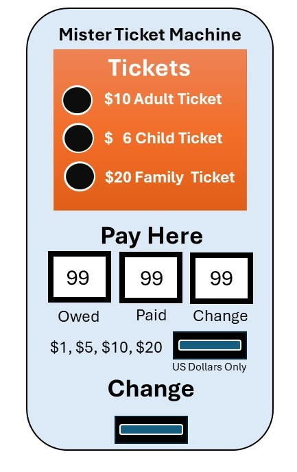

# Ticket Machine Programming Project Document

This project document is work product for lesson *3.13 Plan a programming project* of the Raspberry Pi Foundation course hosted on EdX *Teach teens computing: Developing your programming pedagogy* course.

## Project Brief

This is a project outline that can be given to learners before starting the project. It outlines the problem and solution requirements.

In the project, the learners will create a simple ticket machine simulator for a fictitious theme park.

.jpg)

*By Jedi94 - Own work, CC BY-SA 4.0, https://commons.wikimedia.org/w/index.php?curid=145871253*

### Scenario

**Functional requirements** for a simple theme park ticket machine simulator:

- Allows customer to purchase a single ticket at a time.
- Tickets can be:
  - an adult ticket for $10 US
  - a child ticket for $6 US
  - or a family ticket for $20 US
- Customer pays for tickets by placing dollar bills into slot in machine:
  - $1, $5, $10, and $20 denominations are only dollars accepted
  - unacceptable dollars are returned ($2, $50 and $100)
- Display shows
  - the amount of the ticket selected
  - the amount of money collected so far
  - the remaining amount needed for the ticket
- When an amount greater than or equal to the ticket price has been collected, the machine will stop accepting money.
- If the amount collected is greater than the ticket price, the machine will return the difference in $1, $5, $10 or $20 increments.
  - When selecting the returned bills, the largest denomination less than or equal to the remaining return amount will be chosen before any remaining bills are selected.
  - Example, Child ticket charge $6. $20 paid. First bill returned is $10 followed by four $1 bills.
  - Example, Adult ticket charge $10.  $25 paid ($5 + $20).  First bill returned is $10 followed by $5 bill.



*Mister Ticket Machine Model Graphic*

### Implementation Details

We are not going to build an actual working theme park ticket machine.  Instead, we are going to create a ticket machine simulator.  Your code will:

- Show the customer the available tickets and their prices.
- Ask the customer to select one of the available tickets.
  - The customer input needs to be validated.
- Keep asking the customer for another dollar bill until the value of all dollar bills collected is greater than or equal to the amount owed:
  - Ask the customer to select the dollar denomination that they are going use pay with.
    - The customer input needs to be validated.
  - Keep a running total of the 'money' collected so far.
- If the running total is greater than the value of the ticket, return 'money':
  - Provide the customer with the total amount of the refund.
  - Calculate the number of $1, $5, $10 and $20 dollar bills needed to add up to the refund amount.
    - Provide the least number of dollar bills needed to add up to the refund amount.
      - For a Child ticket costing $6 and $20 paid, return bills in this order: $10, $1, $1, $1, $1.
      - For an Adult ticket costing $10 and  $25 paid ($5 + $20), return bills in this order: is $10, $5.
  - Provide the customer with the list of dollar bills being returned. That is, the number of $20, $10, $5 and $1 that the customer would receive.
    - Only include the dollar bills being returned, not ones that aren't returned.

Students may start with the provided scaffolding program by adding the missing features and capabilities to complete the assignment or just start the assignment without the scaffolding.  Student choice.

### Testing

#### Exception Handling

Keep track of input data validation errors using the following table:

| Input Data            | Error                                                         |
| --------------------- | ------------------------------------------------------------- |
| -1                    | IndexError: list index out of range                           |
| 11                    | IndexError: list index out of range                           |
| abc                   | ValueError: invalid literal for int() with base 10            |
| 1                     |                                                               |
| 2                     |                                                               |
| 3                     |                                                               |
| 4                     |                                                               |
| 5                     |                                                               |

The '-1' input value above may not create an IndexError but may create a functional error.

#### Functional Errors

Convince yourself (and possibly others), that your code works correctly by trying combinations of:

- Ticket types
- Dollar bill denominations

Try to get weird refund amounts.

Document your results using the following table:

| Ticket | Payment            | Expected Change         | Actual Change           |
| -------| ------------------ | ----------------------- | ----------------------- |
| Adult  | $20                | $10: $10                | $10: $10                |
| Child  | $5 + $20           | $19: $10+$5+(4*$1)      | $19: $10+$5+(4*$1)      |
| Family | 20*$1              | None                    | None                    |
| Adult  |                    |                         |                         |
| Child  |                    |                         |                         |
| Family |                    |                         |                         |
| Adult  |                    |                         |                         |
| Child  |                    |                         |                         |
| Family |                    |                         |                         |
| Adult  |                    |                         |                         |
| Child  |                    |                         |                         |
| Family |                    |                         |                         |
| Adult  |                    |                         |                         |
| Child  |                    |                         |                         |
| Family |                    |                         |                         |
| Adult  |                    |                         |                         |
| Child  |                    |                         |                         |
| Family |                    |                         |                         |

## Code

The [Mister Ticket Machine](https://github.com/thatlarrypearson/mister-ticket-machine) code repository is available on github.  It includes this document as well as:

- Complete solution - [mtm complete](https://github.com/thatlarrypearson/mister-ticket-machine/mtm/mtm.py).
- Scaffolding - [mtm scaffolding](https://github.com/thatlarrypearson/mister-ticket-machine/mtm/mtm_scaffolding.py).
- Parson's problem with distractors - [mtm function distractors](https://github.com/thatlarrypearson/mister-ticket-machine/mtm/mtm_function_distractors.py)
- Parson's problem without distractors - [mtm function](https://github.com/thatlarrypearson/mister-ticket-machine/mtm/mtm_function.py)

Both the scaffolding and the complete solution, by the way they were written, cause the learners to be able to see the structure and flow of the program without difficulty.  This should enable the learners to see the underlying Block Model the code embodies.

## Pedagogical Approach

### Live Coding

Instructor starts with live coding covering the following with learners:

- Using the scaffolding as an outline to model **functional decomposition** (*a system design and analysis method that involves breaking down a complex system into smaller, more manageable components*), include as appropriate the following:
  - [Mister Ticket Machine Model Graphic](docs/MisterTicketMachine.jpg) as shown above
  - Functional Requirements
  - Implementation Details
- Instructor live codes their version of the scaffolding.
  - Instructor stubs subroutines/functions
    - Subroutines/functions have a name, argument list, type hints, description of inputs and return values.
  - This level functional decomposition may take multiple sessions.  These sessions can be interspersed with pair programming assignments to complete individual subroutine/functions.
- While thinking out loud, the instructor will include thoughts on how the Block Model applies to the functional decomposition.
- While live coding, show how individual functions can be tested/validated for Exception handling and logic errors.

### Pair Programming

Instructor assigns pair programming project to complete some, but not all of the subroutines/functions that were stubbed out in the scaffolding.

- Have learners swap driver/navigator roles every 15 minutes or so.
- Have learners build testing into each subroutine/function development.
  - Where appropriate, have pairs identify potential Exceptions and defensively code for them.
  - Where appropriate, have pairs test for functional and logic errors.
- Walk the room to:
  - ask questions
  - observe progress
  - spot/correct misconceptions

### Parson's Problem

Based on observations during pair programming, take one of the subroutine/functions found in [mtm_complete](https://github.com/thatlarrypearson/mister-ticket-machine/mtm/mtm.py) and randomize some or all of the lines.

Alternatively, the included [Parson's problem with distractors](https://github.com/thatlarrypearson/mister-ticket-machine/mtm/mtm_function_distractors.py) and [Parson's problem without distractors](https://github.com/thatlarrypearson/mister-ticket-machine/mtm/mtm_function.py) may be used as an assessment tool instead.

### Project Completion

As the project completes, have learners think about ways to extend and improve the simple ticket machine simulator.

Here are some questions to ask learners to facilitate discussion on improving the simple ticket machine simulator:

- What happens when a customer walks away from the ticket machine after selecting a ticket?  How would this affect the next customer?
- What happens when a customer selects a ticket but doesn't have enough money for a ticket?  How would that customer get back the money they already put into the ticket machine?
- Is it a good customer experience to make customers buy and pay for one ticket at a time?
- What happens if the customer only wants two or three child tickets?  What happens if the customer is paying for two families?  Can the customer do this as a single transaction?  What would be easier for the customer?
- What happens if the ticket machine doesn't have enough money to provide change?  Example, customer wants one child ticket but the ticket machine is out of $1 bills.
- Should the ticket machine have an exact amount required indicator?  Should that be enforced in code?  Example, exact amount required but customer only has a $20 dollar bill for a $10 dollar purchase.  Should the purchase be allowed anyway?
- Should the customer be able to see what the rules for each ticket are and where would this be visible to them?  Example, a child's ticket is only for a person 17 and younger in age.  A family ticket is only good for at most two adults and four children.
- Should seniors, veterans or active-duty service members get a discount?  If so, how would the discount be structured?

### Additional Notes

To implement a timeout for the input() function in Python, you can use external libraries like [inputimeout](https://pypi.org/project/inputimeout/) or [timedinput](https://pypi.org/project/timedinput/).  This would allow the ticket machine to recover from a customer that walks away from the kiosk before completing a transaction.

When doing keyboard input on many computers, <CTRL>-C will interrupt the running python program.  The built-in Python Exception for catching keyboard interrupts in ```KeyboardInterrupt```.  This will allow recovery but where this exception handler is placed in the program flow can be tricky.
